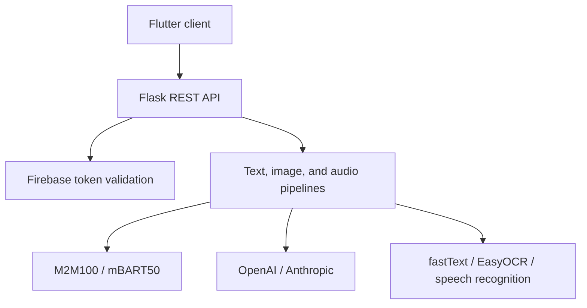

# Translator

A full-stack mobile translation prototype that handles text, images, and recorded audio through local machine-learning models or hosted LLM APIs.

The project explores how multiple AI services can be exposed through one Flask API and consumed by a Flutter client. It includes Firebase authentication, language detection, OCR, speech recognition, translation-engine selection, and short-lived response caching.

> **Project status:** Functional portfolio prototype. It is intended for local development and technical exploration, not production deployment.

## Features

- Translate typed text, recorded audio, and text detected in images.
- Choose between local Hugging Face translation models and hosted LLM APIs.
- Detect input language with the compressed fastText `lid.176.ftz` model.
- Extract text regions from images with EasyOCR.
- Produce translated images with either the original or a white background.
- Authenticate users with Firebase Authentication and validate ID tokens in Flask.
- Cache repeated translations for 10 minutes.

## Architecture



## Translation engines

| Type | Options | Trade-off |
| --- | --- | --- |
| Local ML | M2M100 1.2B, mBART50 | Runs through Hugging Face Transformers but requires substantial download time and memory. |
| Hosted LLM | OpenAI, Anthropic | Easier local resource usage but requires API credentials and may incur usage costs. |

## Tech stack

- **Mobile client:** Flutter, Dart
- **Backend API:** Python, Flask
- **Local AI:** PyTorch, Hugging Face Transformers, fastText
- **Image processing:** EasyOCR, Pillow
- **Audio processing:** SpeechRecognition, pydub
- **Authentication:** Firebase Authentication and Firebase Admin SDK
- **Hosted AI:** OpenAI and Anthropic APIs

## Repository structure

```text
translator/
├── backend/
│   ├── models/       # Model registry and compressed language detector
│   ├── services/     # Translation, OCR, image, and audio services
│   ├── utils/        # Language detection and cache-key helpers
│   └── app.py        # Flask routes and application setup
└── frontend/
    ├── lib/          # Flutter screens, state, and services
    └── android/      # Android platform configuration
```

## Prerequisites

- Python 3.9 or newer
- Flutter with a compatible Dart SDK (`pubspec.yaml` currently requires Dart `^3.5.4`)
- A Firebase project with Email/Password Authentication enabled
- A Firebase Admin service-account JSON file
- FFmpeg available on `PATH` for audio conversion
- OpenAI and Anthropic API keys
- Sufficient disk space and memory for the Hugging Face models

## Backend setup

```bash
git clone https://github.com/ID993/translator.git
cd translator/backend

python -m venv .venv
```

Activate the virtual environment:

```bash
source .venv/bin/activate
```

Install the Python dependencies:

```bash
python -m pip install --upgrade pip
pip install -r requirements.txt
```

Create the local environment file:

```bash
cp .env.example .env
```

Replace the placeholder API keys in `.env`. Download a Firebase Admin service-account file, save it as `backend/firebase-adminsdk.json`, and never commit it.

Start the backend from the `backend` directory:

```bash
python app.py
```

The development server runs at `http://localhost:5000`.

> On the first start, the backend downloads both configured Hugging Face models. This can take significant time and disk space.

## Frontend setup

Install and configure the FlutterFire CLI, then generate the local Firebase configuration:

```bash
dart pub global activate flutterfire_cli
cd ../frontend
flutterfire configure
```

Create the frontend environment file and install packages:

```bash
cp .env.example .env
flutter pub get
flutter run
```

For an Android emulator, `API_URL=http://10.0.2.2:5000` points to the host machine. A physical device needs an address it can reach over the network.

`flutterfire configure` generates platform-specific Firebase files that are intentionally excluded from version control.

## API overview

| Method | Endpoint | Purpose |
| --- | --- | --- |
| `GET` | `/` | Development health check |
| `POST` | `/translate-text` | Translate JSON text input |
| `POST` | `/translate-image` | Process and translate an uploaded image |
| `POST` | `/translate-audio` | Transcribe and translate an uploaded recording |

Translation endpoints require a Firebase ID token:

```http
Authorization: Bearer <firebase-id-token>
```

## Engineering decisions and trade-offs

- The client can switch between local models and LLM providers without changing the UI flow.
- Firebase token validation is applied at the API boundary rather than trusted only on the client.
- The compressed fastText model keeps language detection inside the backend while adding less than 1 MB to the repository.
- Translation responses are cached for 10 minutes to avoid repeating expensive work.
- Local translation models are currently loaded eagerly at startup. This reduces later request latency but makes startup slow and memory-intensive; lazy loading is a planned improvement.

## Current limitations

- Automated tests and continuous integration are not yet included.
- The Flask development server and local file storage are not production-ready.
- Image text replacement uses heuristic layout and font sizing.
- Model loading and inference have not yet been optimized for constrained hardware.
- Error handling and upload validation require additional hardening.

## Planned improvements

- Add unit and API tests with mocked external AI services.
- Add Docker-based local setup and a CI workflow.
- Lazy-load translation models and expose health/readiness endpoints.
- Improve structured logging, monitoring, and temporary-file cleanup.
- Validate file type and size before processing uploads.

## Model attribution

Language identification uses Meta AI's compressed [`lid.176.ftz`](https://fasttext.cc/docs/en/language-identification.html) fastText model. It recognizes 176 languages and is distributed under the Creative Commons Attribution-ShareAlike 3.0 license.